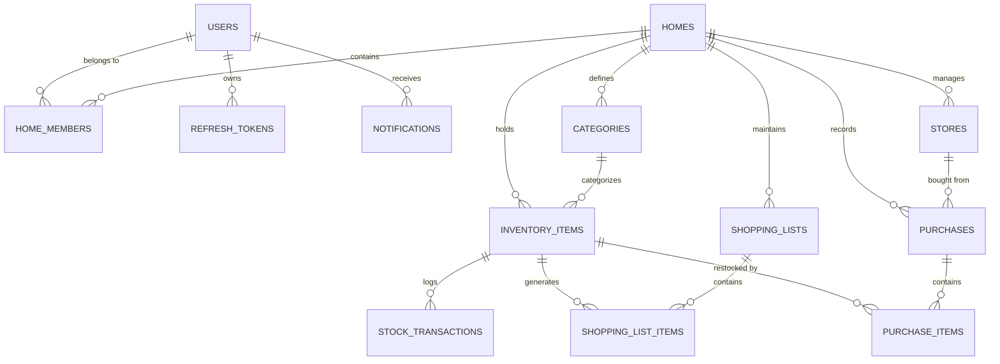

# HomeStock — Database Architecture & Schema Specification

HomeStock uses PostgreSQL as its primary relational database management system. The database is designed for multi-tenant household isolation, atomic inventory balance transactions, audit tracking, and high-performance querying.

---

## 1. Database Connection & Environment

- **RDBMS**: PostgreSQL 16
- **Default Database**: `homestock`
- **Default Port**: `5433` (Dockerized) / `5432` (Standard)
- **ORM / Migrations**: Hibernate 6.6 with JPA 3.1; Flyway migration support
- **Connection Pool**: HikariCP (configured with leak detection and connection timeout)

---

## 2. Entity-Relationship (ER) Overview

---

## 3. Core Tables Specification

### 3.1 `users`
Represents individual accounts across households.

| Column | Type | Constraints | Description |
| :--- | :--- | :--- | :--- |
| `id` | `UUID` | `PRIMARY KEY` | Unique user identifier |
| `email` | `VARCHAR(180)` | `NOT NULL, UNIQUE` | Normalized login email (lowercased) |
| `password_hash` | `VARCHAR(255)` | `NOT NULL` | BCrypt-hashed password |
| `full_name` | `VARCHAR(120)` | `NOT NULL` | Display name |
| `phone_number` | `VARCHAR(30)` | `NULL` | Optional mobile number |
| `avatar_url` | `VARCHAR(500)` | `NULL` | Profile picture URI |
| `is_active` | `BOOLEAN` | `NOT NULL DEFAULT true` | Account active flag |
| `created_at` | `TIMESTAMPTZ` | `NOT NULL DEFAULT now()` | Audit timestamp |
| `updated_at` | `TIMESTAMPTZ` | `NOT NULL DEFAULT now()` | Audit timestamp |

---

### 3.2 `homes`
Represents the shared tenant boundary for household inventory and shopping.

| Column | Type | Constraints | Description |
| :--- | :--- | :--- | :--- |
| `id` | `UUID` | `PRIMARY KEY` | Home identifier |
| `name` | `VARCHAR(120)` | `NOT NULL` | Name of household (e.g. "Beach Villa", "Sharma Household") |
| `invite_code` | `VARCHAR(12)` | `NOT NULL, UNIQUE` | Random alphanumeric 8-char invite code |
| `created_by` | `UUID` | `FOREIGN KEY (users.id)` | Initial household creator |
| `created_at` | `TIMESTAMPTZ` | `NOT NULL DEFAULT now()` | Audit timestamp |
| `updated_at` | `TIMESTAMPTZ` | `NOT NULL DEFAULT now()` | Audit timestamp |

---

### 3.3 `home_members`
Association table enforcing Role-Based Access Control (RBAC) per home.

| Column | Type | Constraints | Description |
| :--- | :--- | :--- | :--- |
| `id` | `UUID` | `PRIMARY KEY` | Membership record ID |
| `home_id` | `UUID` | `FOREIGN KEY (homes.id) ON DELETE CASCADE` | Associated home |
| `user_id` | `UUID` | `FOREIGN KEY (users.id) ON DELETE CASCADE` | Associated user |
| `role` | `VARCHAR(20)` | `NOT NULL` | Enum: `OWNER`, `ADMIN`, `MEMBER`, `VIEWER` |
| `joined_at` | `TIMESTAMPTZ` | `NOT NULL DEFAULT now()` | Join timestamp |

*Composite Unique Index*: `(home_id, user_id)`

---

### 3.4 `categories`
Categories configured per household (with default system templates auto-seeded on home creation: Kitchen, Cleaning, Bathroom, Spices, Dairy, Snacks).

| Column | Type | Constraints | Description |
| :--- | :--- | :--- | :--- |
| `id` | `UUID` | `PRIMARY KEY` | Category identifier |
| `home_id` | `UUID` | `FOREIGN KEY (homes.id) ON DELETE CASCADE` | Scoped home tenant |
| `name` | `VARCHAR(80)` | `NOT NULL` | Category name |
| `icon_name` | `VARCHAR(50)` | `NULL` | Material icon identifier |
| `color_hex` | `VARCHAR(10)` | `NULL` | Hex color code for badges |
| `sort_order` | `INT` | `DEFAULT 0` | UI display ordering |

---

### 3.5 `inventory_items`
Core inventory tracking table.

| Column | Type | Constraints | Description |
| :--- | :--- | :--- | :--- |
| `id` | `UUID` | `PRIMARY KEY` | Item ID |
| `home_id` | `UUID` | `FOREIGN KEY (homes.id) ON DELETE CASCADE` | Scoped home tenant |
| `category_id` | `UUID` | `FOREIGN KEY (categories.id) ON DELETE SET NULL` | Category reference |
| `name` | `VARCHAR(150)` | `NOT NULL` | Item title |
| `brand` | `VARCHAR(100)` | `NULL` | Brand/Manufacturer |
| `quantity` | `NUMERIC(10,3)` | `NOT NULL DEFAULT 0.0 CHECK (quantity >= 0)` | Current stock balance |
| `unit` | `VARCHAR(30)` | `NOT NULL DEFAULT 'pcs'` | Metric/Imperial unit (kg, l, pcs, packs) |
| `minimum_quantity` | `NUMERIC(10,3)` | `NOT NULL DEFAULT 1.0 CHECK (minimum_quantity >= 0)` | Threshold triggering low stock |
| `maximum_quantity` | `NUMERIC(10,3)` | `NULL` | Optional restocking ceiling |
| `storage_location` | `VARCHAR(100)` | `NULL` | Pantry, Fridge, Freezer, Cabinet A, etc. |
| `purchase_price` | `NUMERIC(12,2)` | `NULL` | Last unit purchase cost |
| `purchase_date` | `DATE` | `NULL` | Date of last purchase |
| `expiry_date` | `DATE` | `NULL` | Best before date |
| `notes` | `TEXT` | `NULL` | Free-form household notes |
| `image_url` | `VARCHAR(500)` | `NULL` | Stored item photo |
| `is_deleted` | `BOOLEAN` | `DEFAULT false` | Soft-delete flag |

*Indexes*:
- `idx_inv_home_deleted`: `(home_id, is_deleted)`
- `idx_inv_expiry`: `(home_id, expiry_date)`
- `idx_inv_status`: `(home_id, quantity, minimum_quantity)`

---

### 3.6 `stock_transactions`
Append-only audit ledger recording every quantity delta.

| Column | Type | Constraints | Description |
| :--- | :--- | :--- | :--- |
| `id` | `UUID` | `PRIMARY KEY` | Transaction identifier |
| `inventory_item_id`| `UUID` | `FOREIGN KEY (inventory_items.id) ON DELETE CASCADE` | Target item |
| `user_id` | `UUID` | `FOREIGN KEY (users.id) ON DELETE SET NULL` | Performing user |
| `type` | `VARCHAR(30)` | `NOT NULL` | `STOCK_IN`, `STOCK_OUT`, `AUDIT_CORRECTION`, `EXPIRED_DISCARD` |
| `quantity_delta` | `NUMERIC(10,3)` | `NOT NULL` | Positive or negative delta |
| `previous_quantity`| `NUMERIC(10,3)` | `NOT NULL` | Stock before change |
| `new_quantity` | `NUMERIC(10,3)` | `NOT NULL` | Stock after change |
| `reason` | `VARCHAR(255)` | `NULL` | Audit comment or purchase invoice ref |
| `created_at` | `TIMESTAMPTZ` | `NOT NULL DEFAULT now()` | Event timestamp |

---

### 3.7 `shopping_lists` & `shopping_list_items`
Shared shopping lists with auto-replenishment tracking.

**`shopping_lists`**:
- `id` (UUID PK)
- `home_id` (UUID FK)
- `name` (VARCHAR) — Defaults to "Home Shopping List"
- `is_default` (BOOLEAN) — True for primary list

**`shopping_list_items`**:
- `id` (UUID PK)
- `shopping_list_id` (UUID FK)
- `inventory_item_id` (UUID FK, NULLABLE) — Links to inventory item for auto restock
- `item_name` (VARCHAR)
- `quantity` (NUMERIC(10,3))
- `unit` (VARCHAR)
- `is_completed` (BOOLEAN DEFAULT false)
- `is_auto_generated` (BOOLEAN DEFAULT false) — Flagged true if added by low-stock engine
- `completed_at` (TIMESTAMPTZ NULL)
- `completed_by` (UUID FK)

---

### 3.8 `stores` & `purchases` & `purchase_items`
Purchase recording engine.

**`purchases`**:
- `id` (UUID PK)
- `home_id` (UUID FK)
- `store_id` (UUID FK NULL)
- `recorded_by` (UUID FK)
- `purchase_date` (DATE NOT NULL)
- `total_amount` (NUMERIC(12,2) NOT NULL)
- `currency` (VARCHAR(3) DEFAULT 'INR')
- `receipt_image_url` (VARCHAR(500))
- `notes` (TEXT)

**`purchase_items`**:
- `id` (UUID PK)
- `purchase_id` (UUID FK)
- `inventory_item_id` (UUID FK NULL)
- `item_name` (VARCHAR NOT NULL)
- `quantity` (NUMERIC(10,3) NOT NULL)
- `unit` (VARCHAR NOT NULL)
- `unit_price` (NUMERIC(12,2) NOT NULL)
- `total_price` (NUMERIC(12,2) NOT NULL)

---

## 4. Concurrency & Business Rules Enforced at Database Layer

1. **Non-Negative Stock**: `CHECK (quantity >= 0)` constraint prevents race-condition negative stock levels.
2. **Atomic Restocking Transaction**: When a purchase is saved, Hibernate executes the following within a single `@Transactional` boundary:
   - Insert `purchases` row
   - Insert `purchase_items` rows
   - Increment `inventory_items.quantity` by purchase quantity
   - Insert `stock_transactions` row with `STOCK_IN`
   - Mark matching `shopping_list_items` as `is_completed = true`
3. **Multi-Tenant Scoping**: All queries filter by `home_id` with `@PreAuthorize("@homeSecurity.isMember(#homeId)")` at the service/controller layer.
